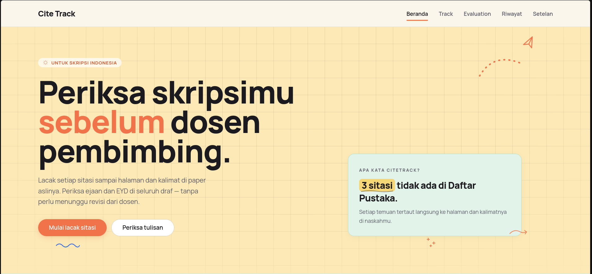

# CiteTrack



A draft-checking tool for Indonesian students writing their skripsi. Drop in one PDF, get two kinds of checks:

1. **Citation tracer.** Parses every in-text citation, matches it to an entry in your Daftar Pustaka, then tries to fetch the source PDF from open providers (CrossRef, OpenAlex, Unpaywall, Europe PMC, Semantic Scholar, PubMed, arXiv, and a few more). When it gets a source, it points to the exact page and passage you cited.
2. **Evaluation.** Checks the writing itself against two rule sets:
   - **KBBI.** Flags words that aren't in the official Indonesian dictionary, with suggested fixes when one's available.
   - **EYD.** Flags violations of the current orthography rules: capitalization, punctuation, baku word forms, and so on.

Every run is saved. The **History** page lists everything you've checked before, with separate tabs for Track and Evaluation.

## How to run locally (via docker compose)

The fastest path. Database, migrations, config seeds, and the KBBI load all happen on first boot.

### What you need first

- Docker Engine 20+ and `docker compose`.

### Steps

```bash
# 1. (Optional) Copy the env template for provider API keys
cp .env.example .env
# Edit .env if you want to add DATABASE_URL, UNPAYWALL_EMAIL, CORE_API_KEY, etc.

# 2. Build and start
docker compose up --build

# On first boot the entrypoint will:
#   - run `drizzle-kit push --force` to create all tables
#   - run `psql -f deploy/seed/configurations.sql` and `vocabulary.sql`
#   - load the KBBI dump into the dictionary table if the file is present
#   - start the server on port 3000

# 3. Open http://localhost:3000
```

### Env vars compose reads

| Env | Default | Notes |
|-----|---------|-------|
| `POSTGRES_PASSWORD` | `postgres` | Postgres user password in the DB container |
| `APP_PORT` | `3000` | Host port to expose |
| `UNPAYWALL_EMAIL` | _empty_ | Enables Unpaywall auto-fetch; needs a contact email |
| `CORE_API_KEY` | _empty_ | Enables CORE full-text search |
| `SEMANTIC_SCHOLAR_API_KEY` | _empty_ | Higher rate limits on Semantic Scholar |
| `NCBI_API_KEY` | _empty_ | Higher rate limits on PubMed / PMC |

The no-key providers (CrossRef, OpenAlex, arXiv, free-tier Europe PMC) are always on.

### Operations

```bash
# Follow logs
docker compose logs -f app

# Nuke everything and restart (deletes all data)
docker compose down -v && docker compose up --build

# Get a psql shell into the DB container
docker compose exec db psql -U postgres -d citetrack
```

## Usage

With the server running, open `http://localhost:3000`.

### Track — trace citations

1. Open the **Track** page from the nav.
2. Drop a PDF onto the upload area, or click to browse. 50 MB max.
3. Wait for text extraction. The citations table fills in as parsing finishes.
4. Each parsed citation gets matched against your Daftar Pustaka entries.
5. For matched entries, CiteTrack hits the open providers to grab the source PDF. Successful fetches show as **fetched**.
6. For each fetched source, the exact passage you cited gets located and shown in the **Passages** section.
7. Click any row to open the source PDF with the cited page highlighted.

### Evaluation — proof the writing

1. Open **Evaluation**.
2. Drop in your thesis PDF (PDF only, 50 MB max).
3. The check runs in three sequential phases:
   - **Extract.** Pulls text from each page.
   - **KBBI.** Looks every token up against the local dictionary, falling back to an external lookup (cached) when needed.
   - **EYD.** Runs the current orthography rules against the extracted text.
4. Per-category counts appear at the top while it's running. Once it's done, the full findings table fills in.
5. Filter findings by category (KBBI / EYD) in the sidebar. Click any finding to jump to that page of the PDF.

### History — past runs

The **History** page shows every upload, split into Track and Evaluation tabs. Click any entry to reopen the report. Everything's persisted, so you don't have to upload anything twice.

## Local Dev Setup

For active development with HMR and faster Vitest runs, run directly on the host instead of Docker.

### Prerequisites

- Bun 1.1 or newer: `curl -fsSL https://bun.sh/install | bash`
- PostgreSQL 14+ running at `localhost:5432`
- `psql` CLI for loading the KBBI dump
- A KBBI dump at `deploy/seed/kbbi-dictionary.sql` (gitignored)

### Steps

```bash
# 1. Install dependencies
bun install

# 2. Set up env
cp .env.example .env.local
# Make sure DATABASE_URL points to your local Postgres.

# 3. Create the database (one time)
createdb citetrack
# or via psql:
#   psql -U postgres -c "CREATE DATABASE citetrack"

# 4. Push the Drizzle schema
bun run db:push

# 5. Seed configurations and vocabulary (both idempotent)
psql "$DATABASE_URL" -f deploy/seed/configurations.sql
psql "$DATABASE_URL" -f deploy/seed/vocabulary.sql

# 6. Load the KBBI dump (~116k rows into the `dictionary` table)
bash deploy/load-kbbi.sh

# 7. Start dev server on port 3000 with HMR
bun run dev
```

Open `http://localhost:3000`.

### Day-to-day commands

```bash
bun run dev           # Dev server, port 3000, SSR + HMR
bun run build         # Production build into .output/
bun run preview       # Run the prod build locally
bun test              # Vitest (NODE_ENV=test, env validation skipped)
bun run lint          # oxlint check
bun run lint:fix      # oxlint with auto-fix
bun run db:generate   # Generate a migration from schema changes
bun run db:migrate    # Apply migrations
bun run db:push       # Push schema directly (dev shortcut, no migration file)
bun run db:studio     # Open Drizzle Studio
```

The husky pre-commit hook runs `oxlint --fix` on staged `.ts` / `.tsx` files. Let it run. Don't bypass with `--no-verify`; fix the lint errors instead.

### Troubleshooting

- **`DATABASE_URL` invalid during dev.** Check that Postgres is running and `.env.local` has the URL. Quick test: `psql "$(grep DATABASE_URL .env.local | cut -d= -f2)" -c 'SELECT 1'`.
- **No KBBI dump.** KBBI lookups still run, but they fall back to a small external-lookup budget and you'll see a lot more false positives. Drop the dump at `deploy/seed/kbbi-dictionary.sql` and run `bash deploy/load-kbbi.sh`.
- **Port 3000 already in use.** Either edit the `dev` script in `package.json` or set `APP_PORT=3001` before `docker compose up`.
- **Vitest timing out on integration tests.** The integration tests need DB access and PDF fixtures under `.claude/pdf_examples/`. Run a faster subset with `bun test tests/services/parser`.

## License

© 2026 CiteTrack. All rights reserved.
